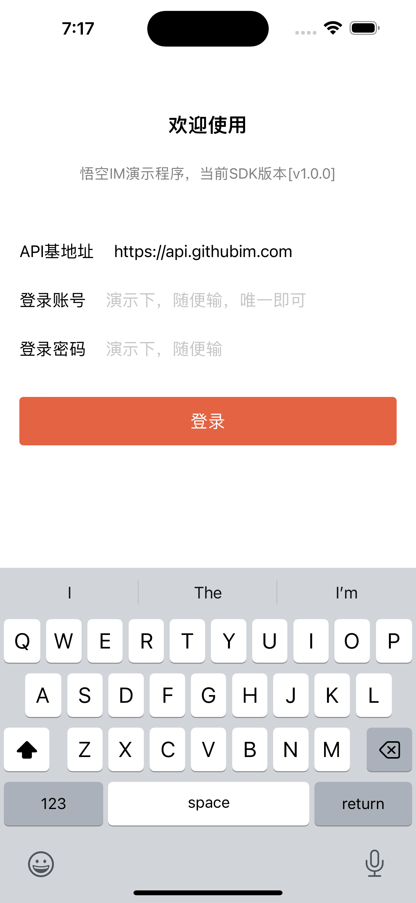

# QCIM

## 说明

本项目是[悟空IM](https://github.com/QCIM/QCIM)端的iOS SDK。

## 运行

进入到项目Example目录内，执行 `pod install`，然后打开 `Example/QCIM.xcworkspace` 运行即可。

## 效果

## 编译SDK

构建模拟器文件

xcodebuild BITCODE_GENERATION_MODE=bitcode OTHER_CFLAGS="-fembed-bitcode" -project '_Pods.xcodeproj' -target 'QCIM' -sdk iphonesimulator

// 生成真机文件

xcodebuild BITCODE_GENERATION_MODE=bitcode OTHER_CFLAGS="-fembed-bitcode" -project '_Pods.xcodeproj' -target 'QCIM' -sdk iphoneos

// 合并模拟器和真机

lipo -create ./Example/build/Release-iphonesimulator/QCIM/QCIM.framework/QCIM  ./Example/build/Release-iphoneos/QCIM/QCIM.framework/QCIM  -output QCIMLib